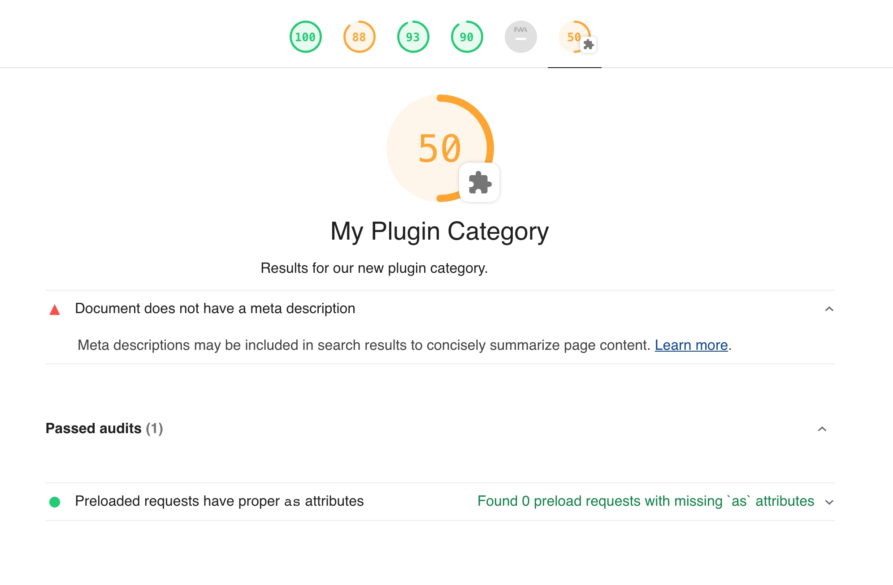

# Lighthouse plugin recipe

## Contents
- `package.json` - declares the plugin's entry point (`plugin.js`)
- `plugin.js` - instructs Lighthouse to run the plugin's own `preload-as.js` audit; describes the new category and its details for the report
- `audits/preload-as.js` - the new audit to run in addition to Lighthouse's default audits

# To develop

Run the following in an empty folder to start of with the code in this recipe:

```sh
curl -L https://github.com/GoogleChrome/lighthouse/archive/master.zip | tar -xzv
mv lighthouse-master/docs/recipes/lighthouse-plugin-example/* ./
rm -rf lighthouse-master
```

Install and run just your plugin:

```sh
yarn
NODE_ENV=.. yarn lighthouse https://example.com --plugins=lighthouse-plugin-example --only-categories=lighthouse-plugin-example --view
```

It may also speed up development if you gather once but iterate in audit mode.

```sh
# Gather artifacts from the browser
yarn lighthouse https://example.com --plugins=lighthouse-plugin-example --only-categories=lighthouse-plugin-example --gather-mode
# and then iterate re-running this:
yarn lighthouse https://example.com --plugins=lighthouse-plugin-example --only-categories=lighthouse-plugin-example --audit-mode --view
```

## To run

1. Install `lighthouse` v5 or later.
2. Install the plugin as a (peer) dependency, parallel to `lighthouse`.
3. Run `npx -p lighthouse lighthouse https://example.com --plugins=lighthouse-plugin-example --view`

The input to `--plugins` will be loaded from `node_modules/`.

## Result


